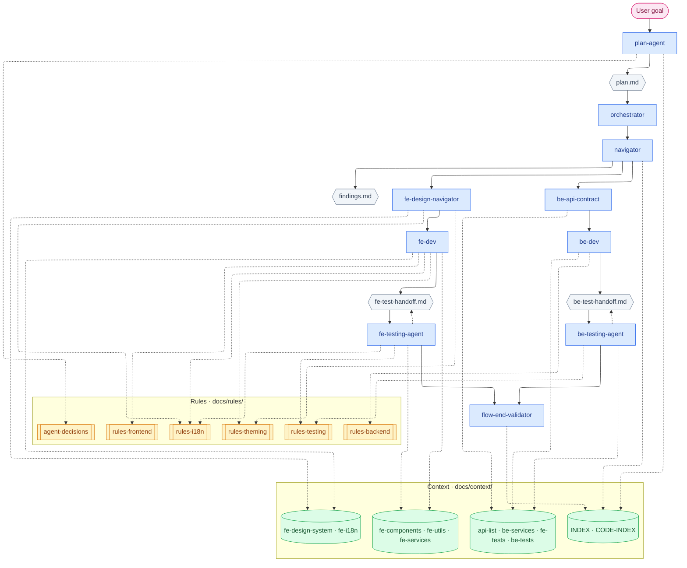
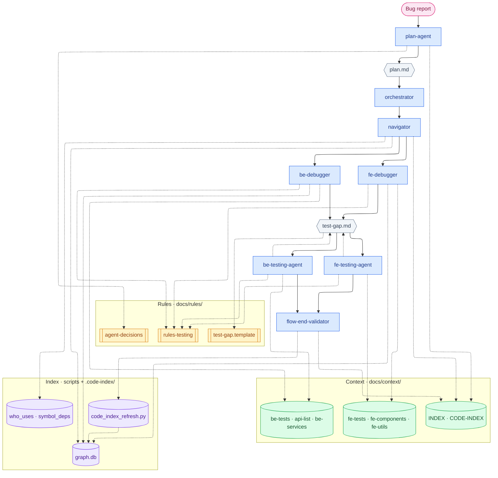

# Agentic workflow — flowcharts

Two high-level views. Solid arrow = runs/writes · dashed arrow = reads only.

Config: [`agentic-flow.yaml`](../agentic-flow.yaml) · Artifacts: [`ARTIFACTS.md`](working/ARTIFACTS.md)

## Legend

| Color | Layer |
|-------|--------|
| Pink | User |
| Blue | Agent |
| Amber | Rules — `docs/rules/` |
| Green | Context — `docs/context/` |
| Purple | Index — `graph.db` + scripts |
| Gray | Working artifact |

---

## 1. Development flow

Orchestrator runs **one step per turn** from `plan.md`. Skip BE or FE branch when scope is API-only or UI-only.

---

## 2. Debugging flow

One lane per task (**BE** or **FE**). Testing step is never skipped when `test-gap.md` exists.
